---
## Front matter
title: "Отчёт по лабораторной работе №5"
subtitle: "Основы работы с
Midnight Commander (mc). Структура программы на
языке ассемблера NASM. Системные вызовы в ОС
GNU Linux"
author: "Малкина Дарья Александровна"

## Generic otions
lang: ru-RU
toc-title: "Содержание"

## Bibliography
bibliography: bib/cite.bib
csl: pandoc/csl/gost-r-7-0-5-2008-numeric.csl

## Pdf output format
toc: true # Table of contents
toc-depth: 2
lof: true # List of figures
lot: true # List of tables
fontsize: 12pt
linestretch: 1.5
papersize: a4
documentclass: scrreprt
## I18n polyglossia
polyglossia-lang:
  name: russian
  options:
	- spelling=modern
	- babelshorthands=true
polyglossia-otherlangs:
  name: english
## I18n babel
babel-lang: russian
babel-otherlangs: english
## Fonts
mainfont: IBM Plex Serif
romanfont: IBM Plex Serif
sansfont: IBM Plex Sans
monofont: IBM Plex Mono
mathfont: STIX Two Math
mainfontoptions: Ligatures=Common,Ligatures=TeX,Scale=0.94
romanfontoptions: Ligatures=Common,Ligatures=TeX,Scale=0.94
sansfontoptions: Ligatures=Common,Ligatures=TeX,Scale=MatchLowercase,Scale=0.94
monofontoptions: Scale=MatchLowercase,Scale=0.94,FakeStretch=0.9
mathfontoptions:
## Biblatex
biblatex: true
biblio-style: "gost-numeric"
biblatexoptions:
  - parentracker=true
  - backend=biber
  - hyperref=auto
  - language=auto
  - autolang=other*
  - citestyle=gost-numeric
## Pandoc-crossref LaTeX customization
figureTitle: "Рис."
tableTitle: "Таблица"
listingTitle: "Листинг"
lofTitle: "Список иллюстраций"
lotTitle: "Список таблиц"
lolTitle: "Листинги"
## Misc options
indent: true
header-includes:
  - \usepackage{indentfirst}
  - \usepackage{float} # keep figures where there are in the text
  - \floatplacement{figure}{H} # keep figures where there are in the text
---

# Цель работы

Приобретение практических навыков работы в Midnight Commander. Освоение инструкций языка ассемблера mov и int.

# Выполнение лабораторной работы

1. Открываем Midnight Commander: 

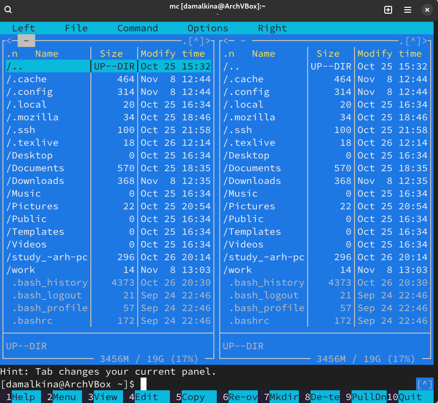{#fig:001 width=70%}

2. Переходим в каталог ~/work/arch-pc и создаем папку lab05, переходим в созданный каталог:

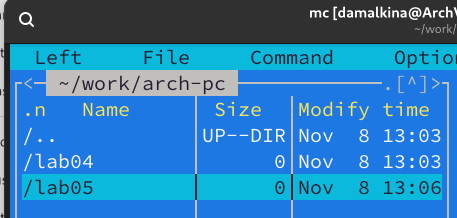{#fig:002 width=70%}

3. В каталоге lab05 с помощью команды touch создаем файл lab5-1.asm, открываем его для редактирования во встроенном редакторе и вводим текст программы:

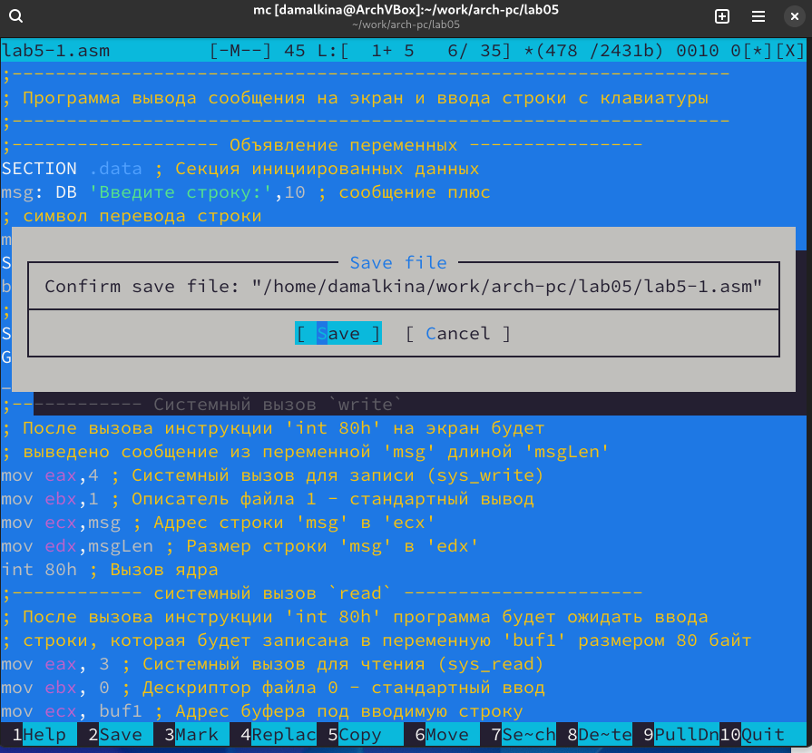{#fig:003 width=70%}

4. Сохраняем изменения и открываем файл для просмотра, чтобы убедиться, что файл содержит текст программы:

{#fig:004 width=70%}

5. Транслируем текст программы в объектный файл, выполняем компановку и запускаем получившийся исполнительный файл:

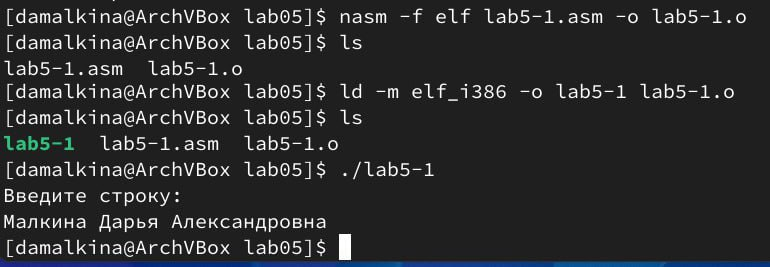{#fig:005 width=70%}

6. Скачиваем файл in_out.asm и копируем его в каталог с файлом lab5-1.asm:

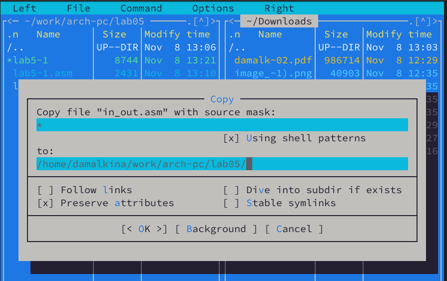{#fig:006 width=70%}

7. Создаем копию файла lab5-1.asm с именем
lab5-2.asm, исправляем текст программы в файле lab5-2.asm с использование подпрограмм из внешнего файла in_out.asm и заменяем подпрограмму sprintLF на sprint:

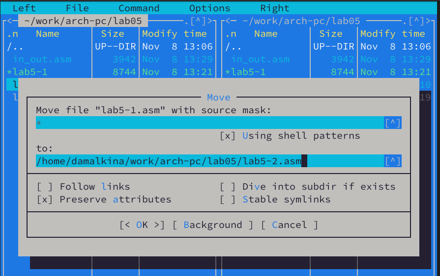{#fig:007 width=70%}

8. Создаем исполнительный файл и проверяем работу, заметим, что работа программы lab5-2 отличается от работы lab5-1, а именно отсутствует отступ после сообщения "Введите текст":

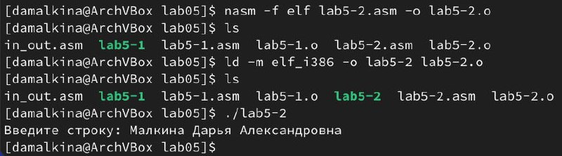{#fig:008 width=70%}

# Выполнение самостоятельной работы

1. Создаем копию файла lab5-1.asm с именем lab5-3.asm, после блока read добавляем в текст программы блок write, чтобы программа выводила введенную строку на экран:

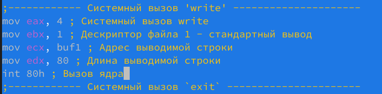{#fig:009 width=70%}

2. Создаем исполнительный файл и проверяем его работу:

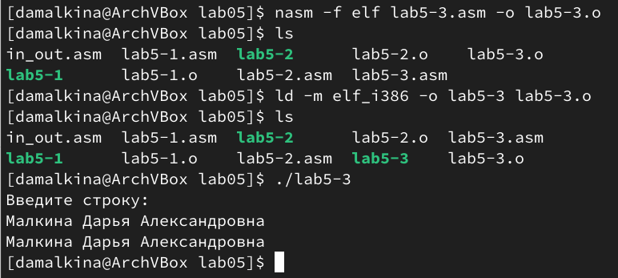{#fig:010 width=70%}

3. Создаем копию файла lab5-2.asm с именем
lab5-4.asm, исправляем текст программы, добавляя подпрограмму sprint из внешнего файла in_out.asm, чтобы программа выводила введенную строку на экран:

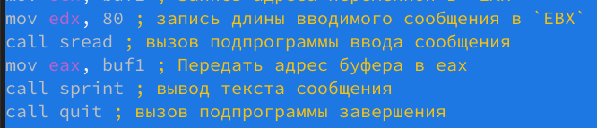{#fig:011 width=70%}

4. Создаем исполнительный файл и проверяем его работу:

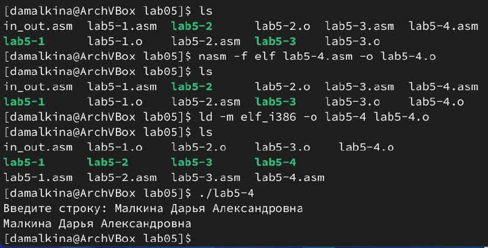{#fig:012 width=70%}

# Вывод

В ходе выполнения лабораторной работы мы познакомились с Midnight Commander и приобрели навыки работы с ним. Освоили инструкции языка ассемблера mov и int, в процессе написания программ, а также научились работать с подпрограммами из внешнего файла.

# Список литературы{.unnumbered}

::: {#refs}
:::
