---
## Front matter
title: "Отчёт по лабораторной работе №6"
subtitle: "Арифметические операции в NASM"
author: "Малкина Дарья Александровна"

## Generic otions
lang: ru-RU
toc-title: "Содержание"

## Bibliography
bibliography: bib/cite.bib
csl: pandoc/csl/gost-r-7-0-5-2008-numeric.csl

## Pdf output format
toc: true # Table of contents
toc-depth: 2
lof: true # List of figures
lot: true # List of tables
fontsize: 12pt
linestretch: 1.5
papersize: a4
documentclass: scrreprt
## I18n polyglossia
polyglossia-lang:
  name: russian
  options:
	- spelling=modern
	- babelshorthands=true
polyglossia-otherlangs:
  name: english
## I18n babel
babel-lang: russian
babel-otherlangs: english
## Fonts
mainfont: IBM Plex Serif
romanfont: IBM Plex Serif
sansfont: IBM Plex Sans
monofont: IBM Plex Mono
mathfont: STIX Two Math
mainfontoptions: Ligatures=Common,Ligatures=TeX,Scale=0.94
romanfontoptions: Ligatures=Common,Ligatures=TeX,Scale=0.94
sansfontoptions: Ligatures=Common,Ligatures=TeX,Scale=MatchLowercase,Scale=0.94
monofontoptions: Scale=MatchLowercase,Scale=0.94,FakeStretch=0.9
mathfontoptions:
## Biblatex
biblatex: true
biblio-style: "gost-numeric"
biblatexoptions:
  - parentracker=true
  - backend=biber
  - hyperref=auto
  - language=auto
  - autolang=other*
  - citestyle=gost-numeric
## Pandoc-crossref LaTeX customization
figureTitle: "Рис."
tableTitle: "Таблица"
listingTitle: "Листинг"
lofTitle: "Список иллюстраций"
lotTitle: "Список таблиц"
lolTitle: "Листинги"
## Misc options
indent: true
header-includes:
  - \usepackage{indentfirst}
  - \usepackage{float} # keep figures where there are in the text
  - \floatplacement{figure}{H} # keep figures where there are in the text
---

# Цель работы

Освоение арифметических инструкций языка ассемблера NASM.

# Выполнение лабораторной работы

## Символьные и численные данные в NASM

1. Создадим каталог для программ лабораторной работы № 6, в нем создадим файл lab6-1.asm, в который введём текст программы из листинга 6.1.:

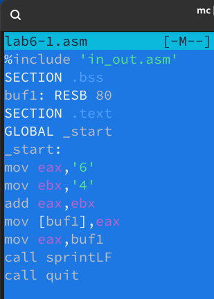{#fig:001 width=70%}

Создаём исполняемый файл и запускаем его, программа выводит символ j:

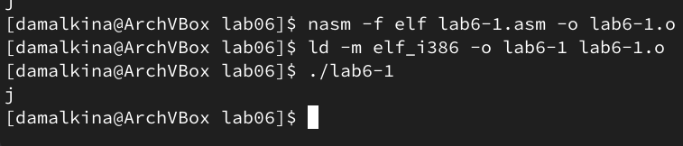{#fig:002 width=70%}

3. Далее изменим текст программы и вместо символов, запишем в регистры числа:

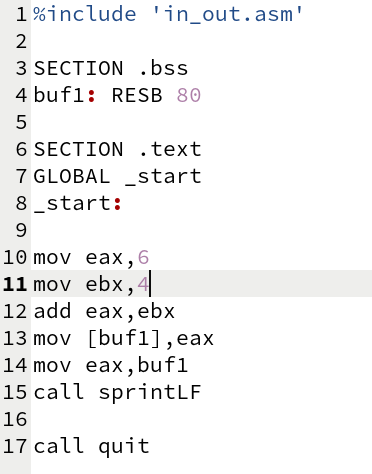{#fig:003 width=70%}

Создаём исполняемый файл и запускаем его, программа выводит символ с кодом 10. Пользуясь таблицей ASCII определяем, что коду 10 соответствует символу перевода строки, что мы и наблюдаем в результате:

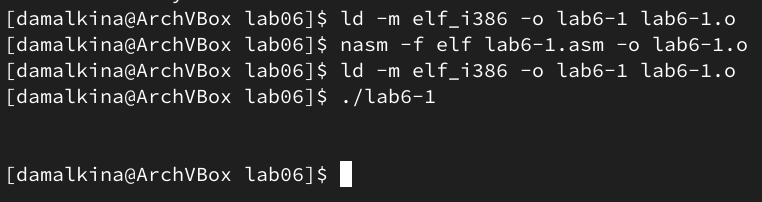{#fig:004 width=70%}

4. Создаём файл lab6-2.asm в каталоге ~/work/arch-pc/lab06 и вводим в него текст программы, преобразованный с использованием функций из внешнего файла in_out.asm:

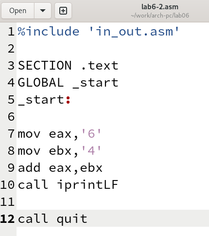{#fig:005 width=70%}

В результате работы программы получаем число 106:

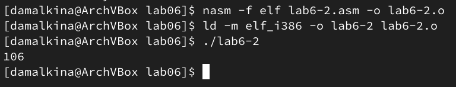{#fig:006 width=70%}

5. Изменим текст программы - вместо символов, запишем в регистры числа: 

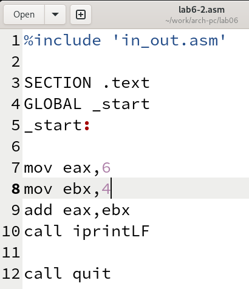{#fig:007 width=70%}

Создаём исполнительный файл и запускаем его, при исполнении программы получили результат 10:

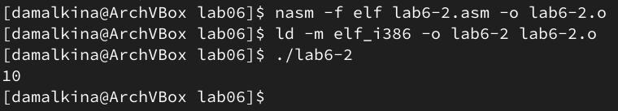{#fig:008 width=70%}

Заменим функцию iprintLF на iprint, тогда после запуска программа не переводит строку по завершении работы:

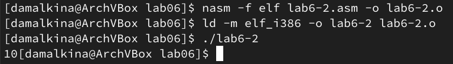{#fig:009 width=70%}

## Выполнение арифметических операций в NASM

6. Создадим файл lab6-3.asm и введем в него программу вычисления арифметического выражения f(x) = (5 ∗ 2 + 3)/3:

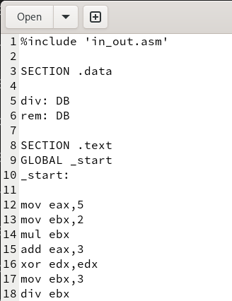{#fig:010 width=70%}

Создаём исполнительный файл и запускаем его:

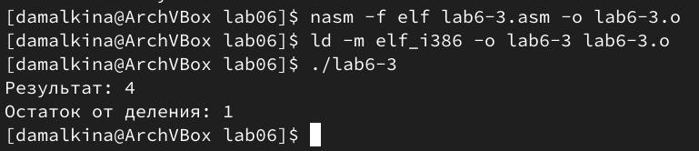{#fig:011 width=70%}

Теперь изменим текст программы, чтобы получить результат вычисления выражения f(x) = (4 ∗ 6 + 2)/5:

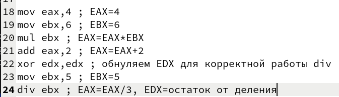{#fig:012 width=70%}

Создаём исполнительный файл и запускаем его:

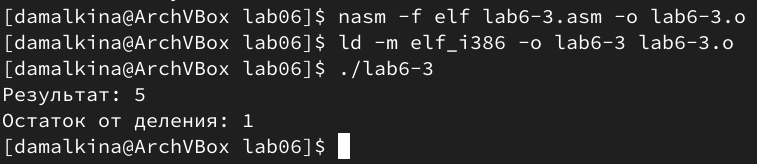{#fig:013 width=70%}

7. Создадим файл variant.asm, введем в файл текст программы, которая будет вычислять вариант задания по номеру студенческого билета. Создаем исполнительный файл var и запускаем его:

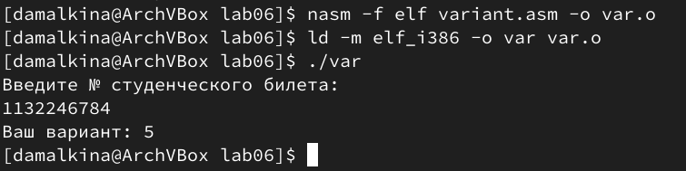{#fig:014 width=70%}

Проверим результат аналитически:
56612339 * 20 = 1132246780
1132246784 - 1132246780 = 4 (остаток от деления)
Получаем 4 + 1 = 5 выриант задания. 

## Оветы на ворпросы

1. За вывод на экран сообщения отвечают следующие строки:

rem: DB 'Ваш вариант: ',0
...
mov eax,rem
call sprint

2. Строки кода ниже отвечают за считывание строки с клавиатуры и сохранение ее в буфер для дальнейшей обработки:
 
mov ecx, x
mov edx, 80
call sread

3. Инструкция “call atoi” используется для вызова функции “atoi”, которая реобразует ascii-код символа в целое число и записает результат в регистр eax.

4. За вычисления варианта отвечают следующие строки кода:

mov eax,x
call atoi
...
xor edx,edx
mov ebx,20
div ebx
inc edx

5. Остаток от деления при выполнении инструкции “div ebx” записывается в регистр edx.

6. Инструкция “inc edx” увеличивает значение в регистре edx на 1. То есть, после деления значение в edx будет остаток от деления, к этому остатку добавляется 1, чтобы получить вариант.

7. За вывод на экран результата вычислений отвечают строки:

mov eax,rem
call sprint
mov eax,edx
call iprintLF

# Выполнение задания для самостоятельной работы

Напишем программу вычисления выражения y = f(x) = (9*x - 8)/8. Возмём за основу текст программы var. Создадим копию файла var.asm файл var5.asm. Внесём изменения:

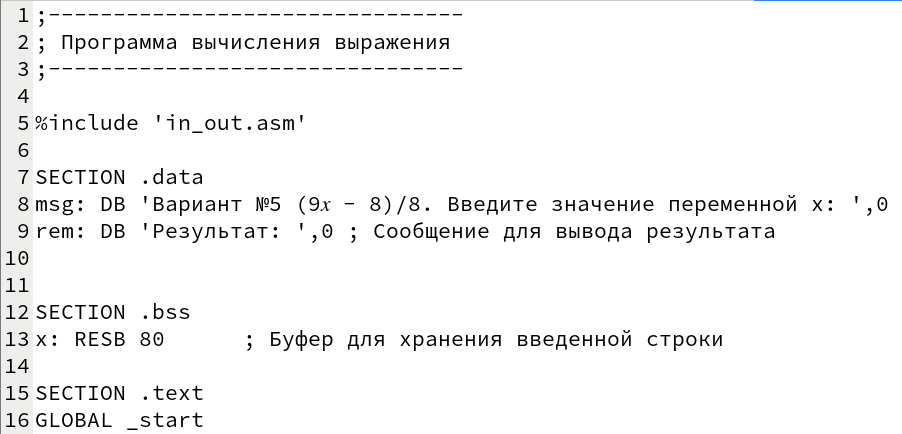{#fig:015 width=70%}

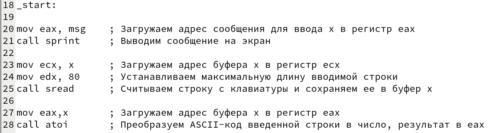{#fig:016 width=70%}

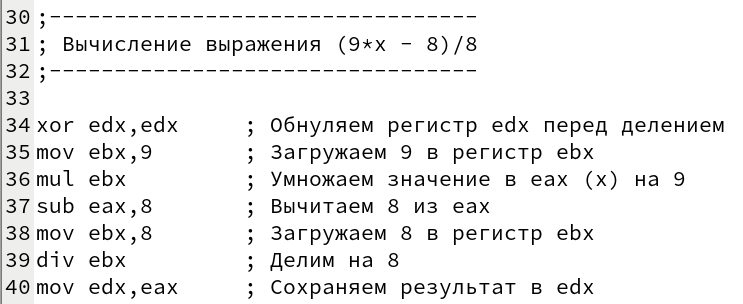{#fig:017 width=70%}

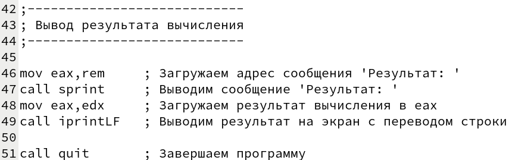{#fig:018 width=70%}

Создаём исполняемый файл и проверяем его работу для значений x1=8 и x2=64:

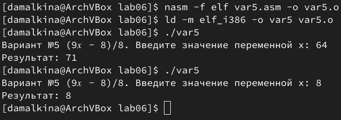{#fig:019 width=70%}

Проверим работу программы посчитав аналитически значения выражения при x1=8 и x2=64:

x1=8: (9*8 - 8)/8 = 64/8 = 8
x2=64: (9*64 - 8)/8 = 8*(72 - 1)/8 = 71

Программа работает верно.

# Выводы

В ходе выполнения лабораторной работы мы узнали об арифметических инструкциях языка ассемблера NASM и научились их использовать при написании текста программы. Также научились создавать ассемблерную программу, которая считывает данные от пользователя, выполняет арифметические операции и выводит результат на экран. Мы узнали, как выполнять операции умножения и деления, а также как использовать подпрограммы для ввода-вывода. Кроме того, мы научились правильно обрабатывать данные, которые пользователь вводит с клавиатуры, преобразуя их из ASCII-кода в числовое значение.

# Список литературы{.unnumbered}

::: {#refs}
:::
