---
## Front matter
title: "Отчёт по лабораторной работе №7"
subtitle: "Команды безусловного и
условного переходов в Nasm. Программирование
ветвлений."
author: "Малкина Дарья Александровна"

## Generic otions
lang: ru-RU
toc-title: "Содержание"

## Bibliography
bibliography: bib/cite.bib
csl: pandoc/csl/gost-r-7-0-5-2008-numeric.csl

## Pdf output format
toc: true # Table of contents
toc-depth: 2
lof: true # List of figures
lot: true # List of tables
fontsize: 12pt
linestretch: 1.5
papersize: a4
documentclass: scrreprt
## I18n polyglossia
polyglossia-lang:
  name: russian
  options:
	- spelling=modern
	- babelshorthands=true
polyglossia-otherlangs:
  name: english
## I18n babel
babel-lang: russian
babel-otherlangs: english
## Fonts
mainfont: IBM Plex Serif
romanfont: IBM Plex Serif
sansfont: IBM Plex Sans
monofont: IBM Plex Mono
mathfont: STIX Two Math
mainfontoptions: Ligatures=Common,Ligatures=TeX,Scale=0.94
romanfontoptions: Ligatures=Common,Ligatures=TeX,Scale=0.94
sansfontoptions: Ligatures=Common,Ligatures=TeX,Scale=MatchLowercase,Scale=0.94
monofontoptions: Scale=MatchLowercase,Scale=0.94,FakeStretch=0.9
mathfontoptions:
## Biblatex
biblatex: true
biblio-style: "gost-numeric"
biblatexoptions:
  - parentracker=true
  - backend=biber
  - hyperref=auto
  - language=auto
  - autolang=other*
  - citestyle=gost-numeric
## Pandoc-crossref LaTeX customization
figureTitle: "Рис."
tableTitle: "Таблица"
listingTitle: "Листинг"
lofTitle: "Список иллюстраций"
lotTitle: "Список таблиц"
lolTitle: "Листинги"
## Misc options
indent: true
header-includes:
  - \usepackage{indentfirst}
  - \usepackage{float} # keep figures where there are in the text
  - \floatplacement{figure}{H} # keep figures where there are in the text
---

# Цель работы

Изучение команд условного и безусловного переходов. Приобретение навыков написания программ с использованием переходов. Знакомство с назначением и структурой файла листинга.

# Выполнение лабораторной работы

## Реализация переходов в NASM

1. Создадим каталог для программ лабораторной работы №7, в нем создадим файл lab7-1.asm и введем в созданный файл текст программы из листинга 7.1. После создаем исполнительный файл и запускаем его:

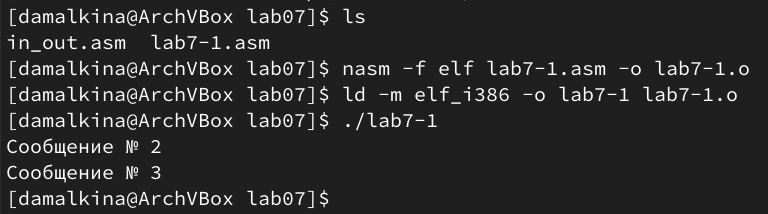{#fig:001 width=70%}

2. Изменим программу, чтобы она выводила сначала ‘Сообщение №2’, потом ‘Сообщение №1’ и завершала работу:

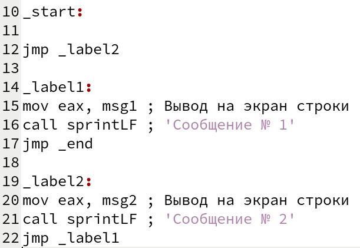{#fig:002 width=70%}

Создаем исполнительный файл и запускаем его:

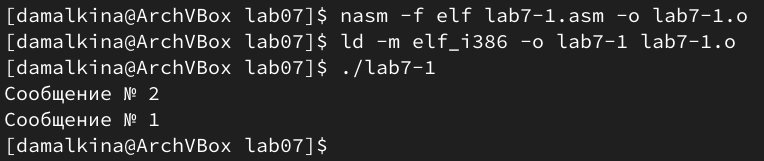{#fig:003 width=70%}

Снова изменим программу, чтобы теперь она выводила сначала ‘Сообщение №3’, потом ‘Сообщение №2’, затем ‘Сообщение №3’ и завершала работу:

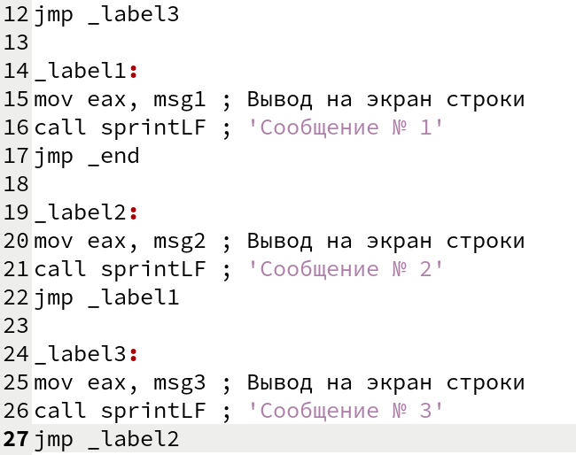{#fig:004 width=70%}

Создаем исполнительный файл и запускаем его:

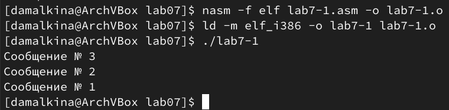{#fig:005 width=70%}

3. Создадим файл lab7-2.asm и введем в созданный файл текст программы, которая определяет и выводит на экран наибольшую из 3 целочисленных переменных: A,B и C. После создаем исполнительный файл и запускаем его:

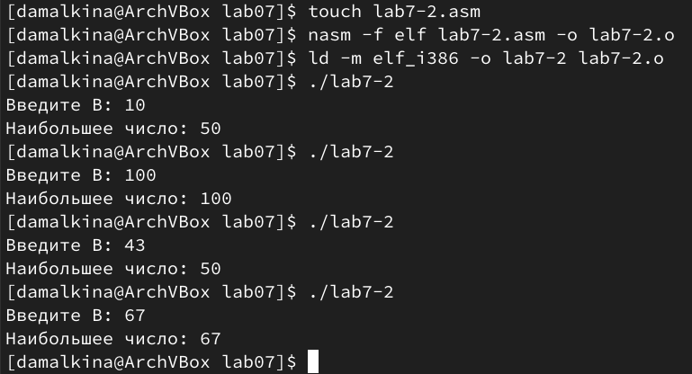{#fig:006 width=70%}

## Изучение структуры файлы листинга

1. Создадим файл листинга для программы из файла lab7-2.asm:

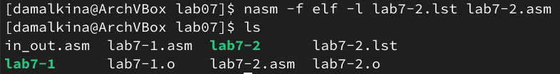{#fig:007 width=70%}

Откроем его с помощью текстового редактора:

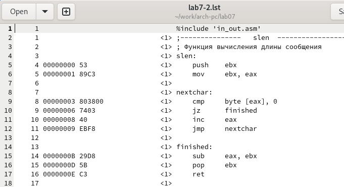{#fig:008 width=70%}

2. Рассмотрим 28, 34 и 51 строки листинга:

28 00000101 B8[0A000000]      mov eax,B
28 - номер строки в листинге
00000101 - адресс в памяти, с которого начинается команда
B8 - машинный код для команды mov eax шестнадцетиричном представлении, команда копирует значение B в eax
[0A000000] - адрес в памяти, по которому хранится значение переменной B
mov eax,B - исходный текст программы

34 00000116 890D[00000000]     mov [max],ecx
34 - номер строки
00000116 - адресс в памяти, с которого начинается команда
890D - машинный код для команды mov [max],ecx в шестнадцетиричном представлении, команда копирует значение из регистра ecx в переменную [max]
[00000000] - адресс в памяти, по которому храниться значение переменной [max]
mov [max],ecx - исходный текст программы

51 0000014B 7F0C          jg fin
51 - номер строки в листинге
0000014B - адресс в памяти, с которого начинается программа
7F0C - машинный код для команды jg fin в шестнадцатеричном представлении, команда выполняет условный переход на метку fin, если значение в регистре flags указывают на то, что результат сравнения max(A,C)>B истинно
jg fin - исходный текст программы

3. Вернемся к файлу lab7-2.asm и изменим текст программы, удалим операнд B в иструкции mov eax,B на 28 строке кода:

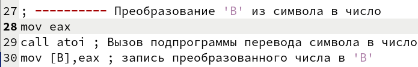{#fig:009 width=70%}

После изменений в тексте программы выполняем трансляцию с получением файла листинга, заметим, что теперь в 28 строке сообщение об ошибке:

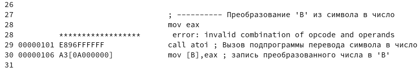{#fig:010 width=70%}

# Выполнение задания для самостоятельной работы

1. Напишем программу нахождения наименьшей из 3 целочисленных переменных A, B и C, сначала задаем переменные и выделяем память для результата:

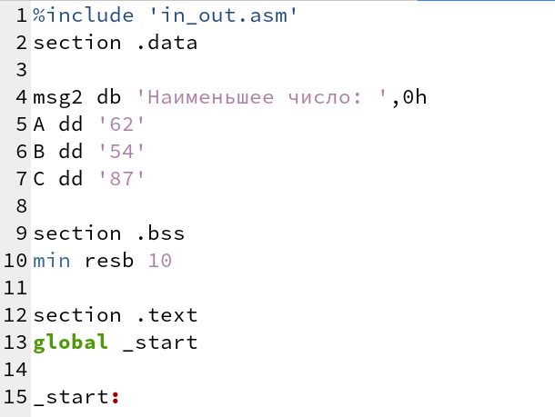{#fig:011 width=70%}

Преобразовываем 'B' из символа в число:

{#fig:012 width=70%}

Далее записываем 'А' в переменную min, после чего сравниваем 'A' и 'C' как символы, если 'A' будет меньше 'C', то по флагу jb check_B мы перейдем к сравнению 'A' и 'B', иначе будем сравнивать 'C' и 'B':

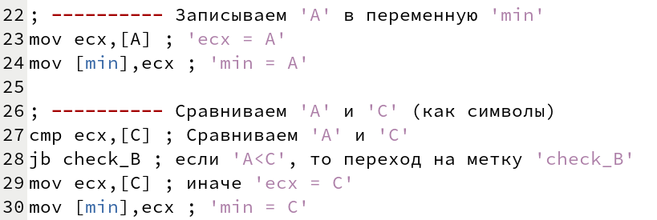{#fig:013 width=70%}

Если 'A' меньше 'C', то переходим к сравнению 'A' и 'B', для этого преобразовываем 'min' из символа в число, и после сравниваем 'min' и 'B' как числа, в конце выводим результат:

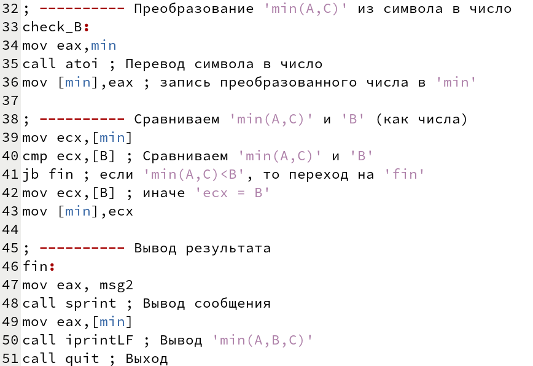{#fig:014 width=70%}

Проверяем результат:

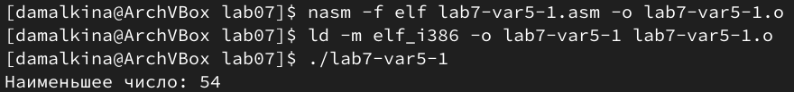{#fig:015 width=70%}

2. Напишем программу, которая для введенных с клавиатуры значений X и A вычисляет значение функции f(x)=15 при A>X, f(x)=2*(X-A) при A<=X  и выводит результат вычислений:

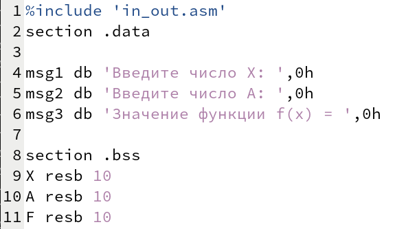{#fig:016 width=70%}

Запишем команды для вывода сообщений и ввода переменных с клавиатуры, преобразуме переменные из символов в числа:

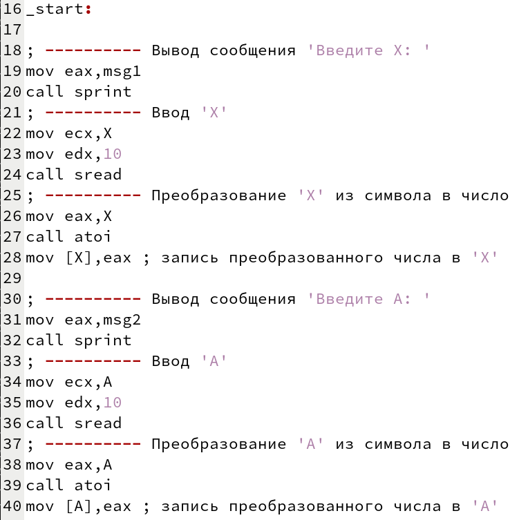{#fig:017 width=70%}

Теперь переменные можно сравнить как числа, если A будет юольше X, то по флагу jg com1 мы перейдем к сравнению вычислению выражения 2*(X-A), иначе функция примет значение равное 15:

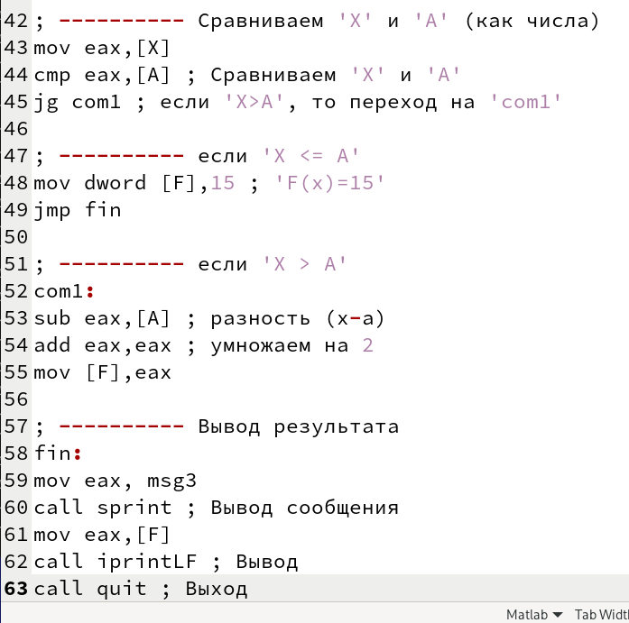{#fig:018 width=70%}

Проверим результат:

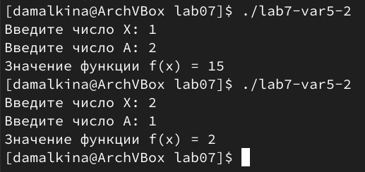{#fig:019 width=70%}

# Выводы

В ходе выполнения лабораторной работы мы изучили команды условного и безусловного переходов. А также написали программы с использованием переходов. Мы познакомились с назначением и структурой файла листинга.

# Список литературы{.unnumbered}

::: {#refs}
:::
