---
## Front matter
title: "Отчёт по лабораторной работе №8"
subtitle: "Программирование
цикла. Обработка аргументов командной строки."
author: "Малкина Дарья Александровна"

## Generic otions
lang: ru-RU
toc-title: "Содержание"

## Bibliography
bibliography: bib/cite.bib
csl: pandoc/csl/gost-r-7-0-5-2008-numeric.csl

## Pdf output format
toc: true # Table of contents
toc-depth: 2
lof: true # List of figures
lot: true # List of tables
fontsize: 12pt
linestretch: 1.5
papersize: a4
documentclass: scrreprt
## I18n polyglossia
polyglossia-lang:
  name: russian
  options:
	- spelling=modern
	- babelshorthands=true
polyglossia-otherlangs:
  name: english
## I18n babel
babel-lang: russian
babel-otherlangs: english
## Fonts
mainfont: IBM Plex Serif
romanfont: IBM Plex Serif
sansfont: IBM Plex Sans
monofont: IBM Plex Mono
mathfont: STIX Two Math
mainfontoptions: Ligatures=Common,Ligatures=TeX,Scale=0.94
romanfontoptions: Ligatures=Common,Ligatures=TeX,Scale=0.94
sansfontoptions: Ligatures=Common,Ligatures=TeX,Scale=MatchLowercase,Scale=0.94
monofontoptions: Scale=MatchLowercase,Scale=0.94,FakeStretch=0.9
mathfontoptions:
## Biblatex
biblatex: true
biblio-style: "gost-numeric"
biblatexoptions:
  - parentracker=true
  - backend=biber
  - hyperref=auto
  - language=auto
  - autolang=other*
  - citestyle=gost-numeric
## Pandoc-crossref LaTeX customization
figureTitle: "Рис."
tableTitle: "Таблица"
listingTitle: "Листинг"
lofTitle: "Список иллюстраций"
lotTitle: "Список таблиц"
lolTitle: "Листинги"
## Misc options
indent: true
header-includes:
  - \usepackage{indentfirst}
  - \usepackage{float} # keep figures where there are in the text
  - \floatplacement{figure}{H} # keep figures where there are in the text
---

# Цель работы

Приобретение навыков написания программ с использованием циклов и обработкой
аргументов командной строки.

# Выполнение лабораторной работы

## Реализация циклов в NASM

1. Создаём файл lab8-1.asm и вводим в него текст программы из листинга 8.1, после создаём исполнительный файл и запускаем его:

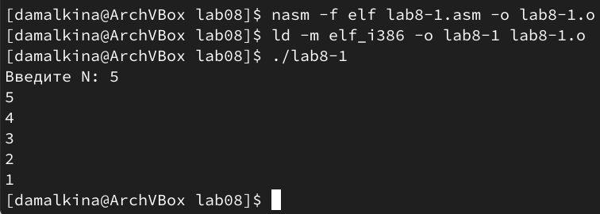{#fig:001 width=70%}

Замечаем, что программа работает некорректно, вносим изменения:

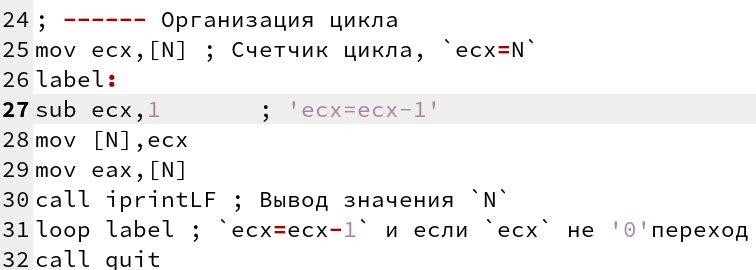{#fig:002 width=70%}
 
Создаём исполнительный файли запускаем изменённую программу, в результате получаем бесконечный цикл, который возникает из-за отсутсвия условия выхода из цикла loop, так как мы переписываем значение N новым значением ecx, то ecx никогда не достигает 0:
 
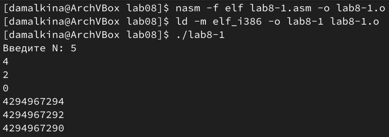{#fig:003 width=70%}
 
Снова вносим изменения в текст программы, добавляем стек:

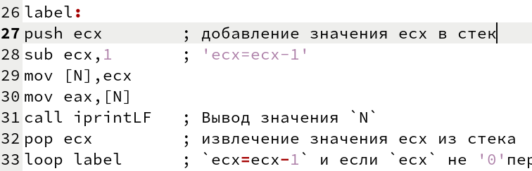{#fig:004 width=70%}
 
Запускаем исправленную программу, теперь вывод верный, программа работает корректно, число проходов цикла соответствует значению 𝑁, введенному с клавиатуры:

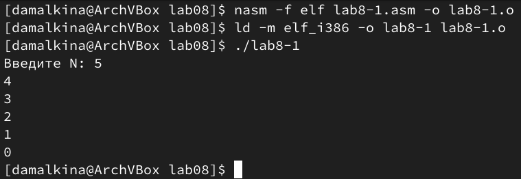{#fig:005 width=70%}

## Обработка аргументов командной строки

2. Создаём файл lab8-2.asm и вводим в него текст программы из листинга 8.2 после создаём исполняемый файл и запускаем его, указав аргументы:

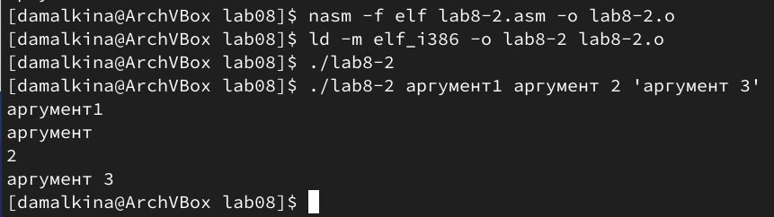{#fig:006 width=70%}

В итоге программой было обработано четыре аргумента.

3. Создаём ещё файл lab8-3.asm и вводим в него текст программы, которая выводит сумму введённых аргументов, после создаём исполняемый файл и запускаем его, указав аргументы:

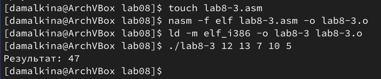{#fig:007 width=70%}

Изменим текст программы так, что бы выводом было произведение введённых аргументов:

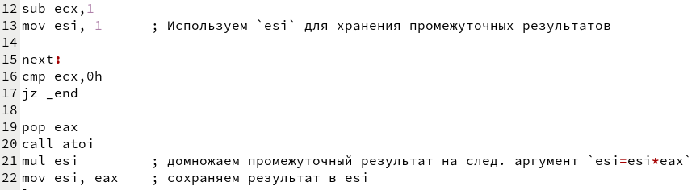{#fig:008 width=70%}

Создаём исполнительный файл и запускаем его, указав аргументы:

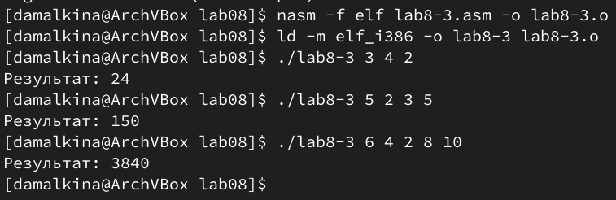{#fig:009 width=70%}

Проверяем, проведя расчёты вручную, и убеждаемся, что программа работает корректно.

# Задание для самостоятельной работы

1. Напишем программу, которая будет находить сумму значений f(x)=4*x+3.
Зададим сообщения, которые будут выводся по окончании работы программы:

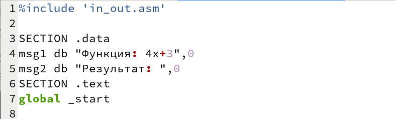{#fig:010 width=70%}

Пропишем извлечение из стека в ecx количество аргументов и извлечение из стека в edx имя программы, а также переход к следующим аргументам и используем esi для хранения промежуточных результатов:

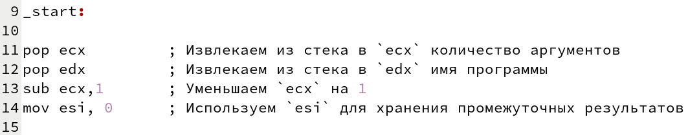{#fig:011 width=70%}

Затем пропишем вычисление, сохраняя результат в esi, и переход к обработке следующего аргумента, если есть ещё аргументы:

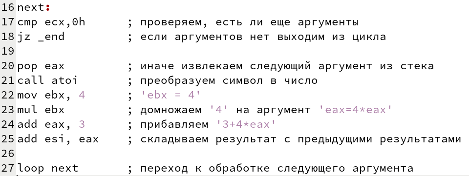{#fig:012 width=70%}

Наконец напишем вывод сообщений msg1 и msg2, вывод результата и завершение программы:

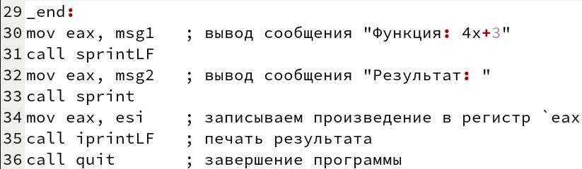{#fig:013 width=70%}

Создаём исполнительный файл и запускаем его, проверим работу программы с разными аргументами:

{#fig:014 width=70%}

Проверяем, проведя расчёты вручную, и убеждаемся, что программа работает корректно.

# Выводы

В ходе лабораторной работы мы изучили программирование циклов и обработку аргументов командной строки, также попрактиковались работать с циклами, аргументами и ошибками, которые возникают при неверном управлении циклами и стеком.

# Список литературы{.unnumbered}

::: {#refs}
:::
