---
## Front matter
title: "Отчёт по лабораторной работе №9"
subtitle: "Понятие подпрограммы.
Отладчик GDB."
author: "Малкина Дарья Александровна"

## Generic otions
lang: ru-RU
toc-title: "Содержание"

## Bibliography
bibliography: bib/cite.bib
csl: pandoc/csl/gost-r-7-0-5-2008-numeric.csl

## Pdf output format
toc: true # Table of contents
toc-depth: 2
lof: true # List of figures
lot: true # List of tables
fontsize: 12pt
linestretch: 1.5
papersize: a4
documentclass: scrreprt
## I18n polyglossia
polyglossia-lang:
  name: russian
  options:
	- spelling=modern
	- babelshorthands=true
polyglossia-otherlangs:
  name: english
## I18n babel
babel-lang: russian
babel-otherlangs: english
## Fonts
mainfont: IBM Plex Serif
romanfont: IBM Plex Serif
sansfont: IBM Plex Sans
monofont: IBM Plex Mono
mathfont: STIX Two Math
mainfontoptions: Ligatures=Common,Ligatures=TeX,Scale=0.94
romanfontoptions: Ligatures=Common,Ligatures=TeX,Scale=0.94
sansfontoptions: Ligatures=Common,Ligatures=TeX,Scale=MatchLowercase,Scale=0.94
monofontoptions: Scale=MatchLowercase,Scale=0.94,FakeStretch=0.9
mathfontoptions:
## Biblatex
biblatex: true
biblio-style: "gost-numeric"
biblatexoptions:
  - parentracker=true
  - backend=biber
  - hyperref=auto
  - language=auto
  - autolang=other*
  - citestyle=gost-numeric
## Pandoc-crossref LaTeX customization
figureTitle: "Рис."
tableTitle: "Таблица"
listingTitle: "Листинг"
lofTitle: "Список иллюстраций"
lotTitle: "Список таблиц"
lolTitle: "Листинги"
## Misc options
indent: true
header-includes:
  - \usepackage{indentfirst}
  - \usepackage{float} # keep figures where there are in the text
  - \floatplacement{figure}{H} # keep figures where there are in the text
---

# Цель работы

Приобретение навыков написания программ с использованием подпрограмм. Знакомство
с методами отладки при помощи GDB и его основными возможностями.

# Выполнение лабораторной работы

1. Сначала создадим каталог lab09 и файл lab9-1.asm. Рассмотрим программу, вычисляющую f(x)=2x+7 с помощью подпрограммы _calcul. Добавим в файл lab9-1.asm текст программы из листинга 9.1. Создадим исполняемый файл и проверим его работу:

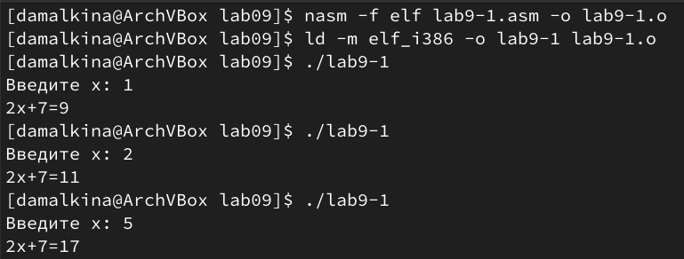{#fig:001 width=70%}

После этого добавим в программу подпрограмму _subcalcul внутри _calcul, чтобы _subcalcul вычисляла g(x) = 3x-1, а после передавала значение x в _calcul, где будет вычислено f(g(x)):

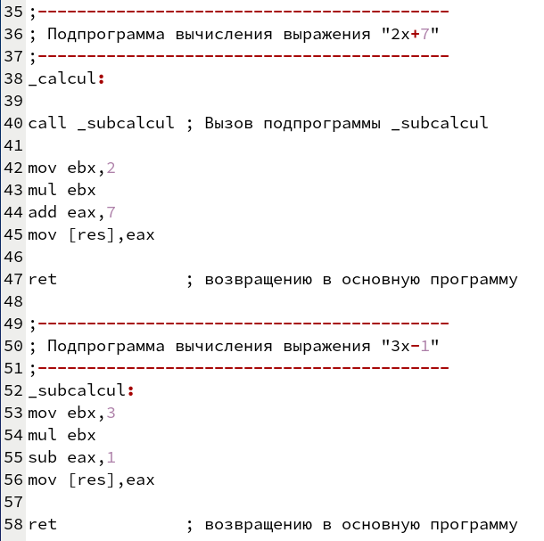{#fig:002 width=70%}

Создадим исполняемый файл и проверим его работу:

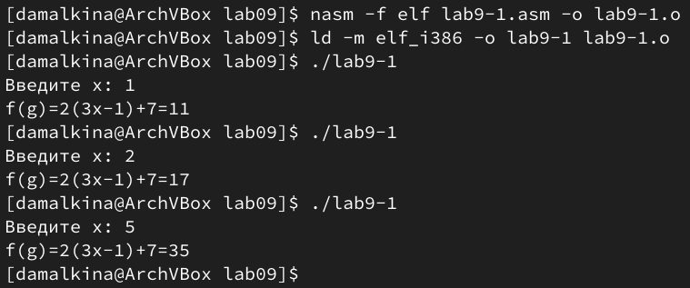{#fig:003 width=70%}

## Отладка программам с помощью GDB

2. Создадим файл lab9-2.asm с программой из листинга 9.2 и соберем исполняемый файл. Добавим отладочную информацию, используя ключ -g: 

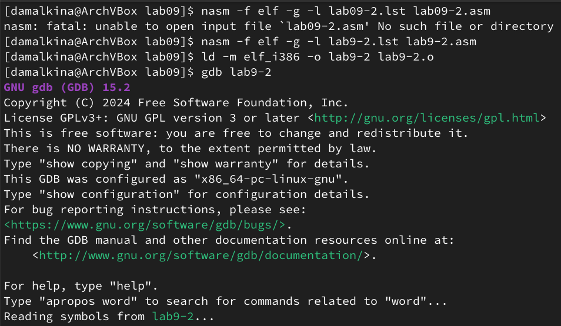{#fig:004 width=70%}

После этого загрузим исполняемый файл в отладчик GDB и проверим работу программы командой run:

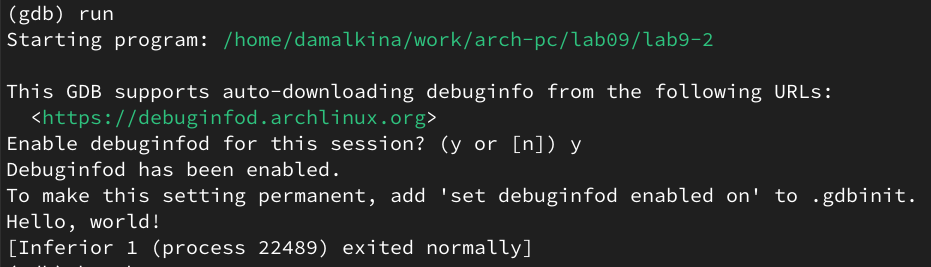{#fig:005 width=70%}

Далее установим точку останова на метке _start командой break _start и запустим программу еще раз:

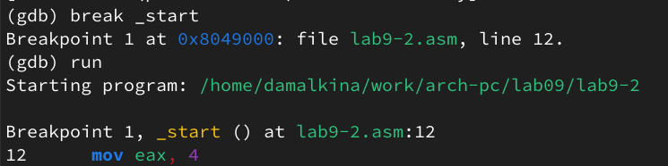{#fig:006 width=70%}

Затем посмотрим дизассемблированный код командой disassemble _start:

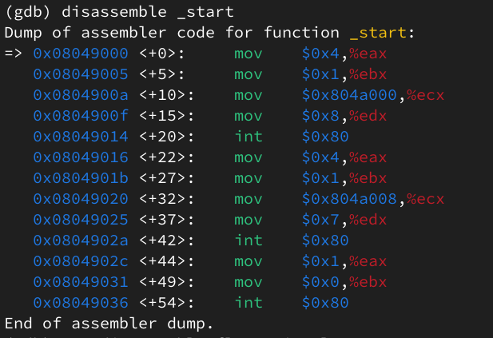{#fig:007 width=70%}

Переключимся на синтаксис Intel командой set disassembly-flavor intel и снова выведем дизассемблированный код:

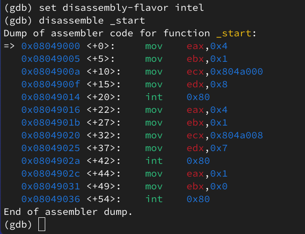{#fig:008 width=70%}

Заметим, что отображения кода в режимах ATT и Intel различаются:

Режим ATT - операнды пишутся в порядке источник, затем приемник, при этом перед именем регистра ставится символ %, а непосредственные значения обозначаются знаком $ перед числом. 

Режим Intel - операнды пишутся в порядке приемник, затем источник. Префикса % перед регистрами нет и нак $ не используется для обозначения непосредственных значений. 

Включим режим псевдографики командами layout asm и layout regs:

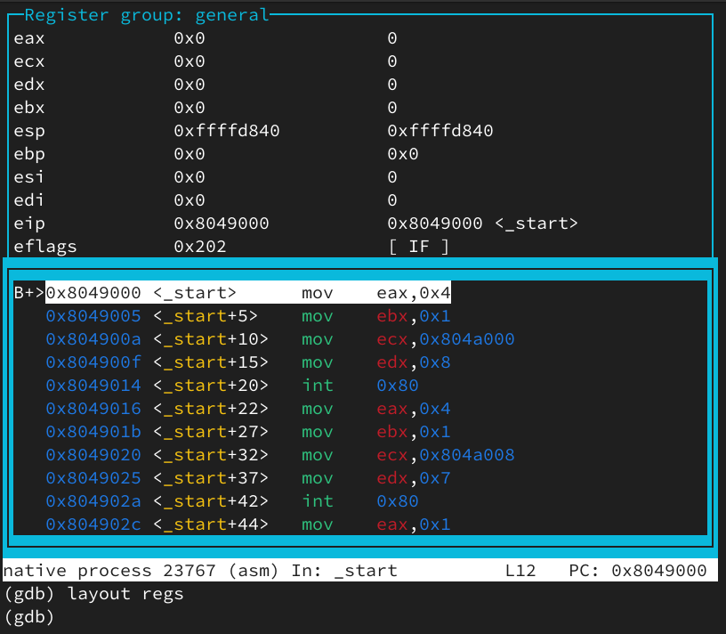{#fig:009 width=70%}

### Добавление точек останова

До этого мы установили точку останова на метке _start, проверим это командой info breakpoints (i b). Затем по адресу инструкции установим еще одну точку останова командой break *<адрес>. После посмотрим информацию о всех установленных точках останова командой i b:

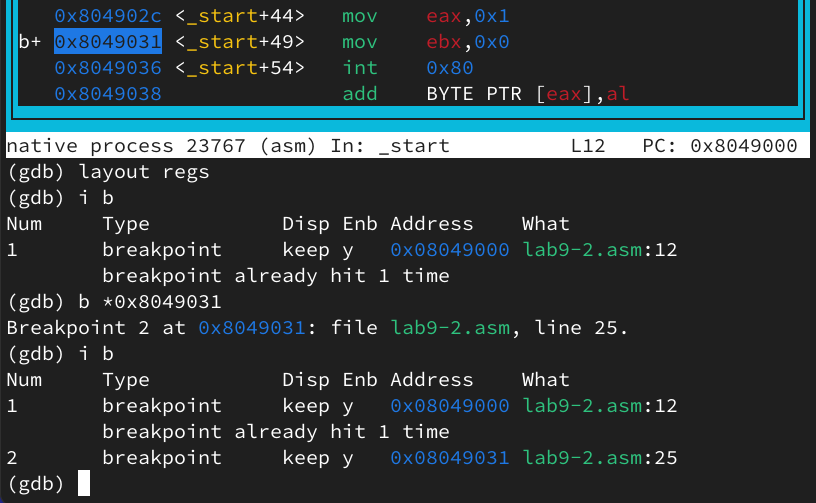{#fig:010 width=70%}

### Работа с данными программы в GDB

Воспользуемся командой stepi (si) пять раз, и понаблюдаем, как меняются значения регистров после каждой инструкции:

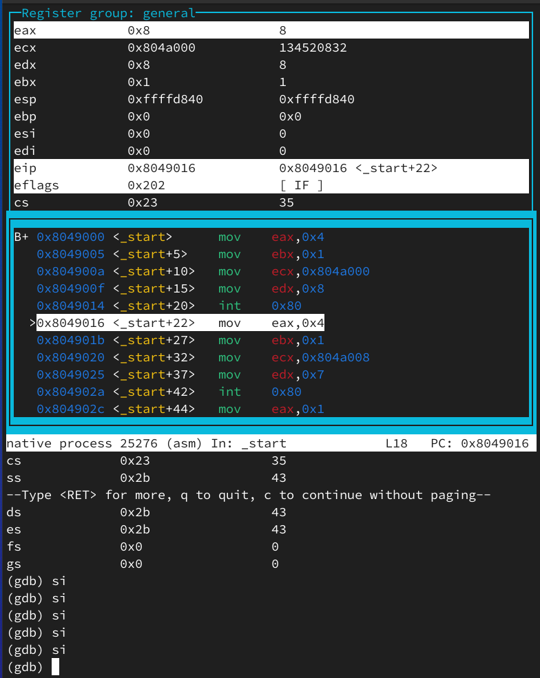{#fig:011 width=70%}

Воспользуемся командой x/1sb &msg1 для просмотра значения msg1. Затем мы найдем значение msg2 по адресу (определим адресс в дизассемблированной инструкции).

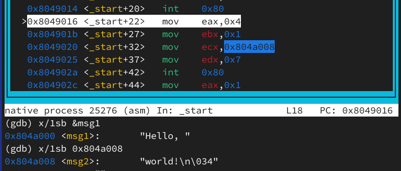{#fig:012 width=70%}

Изменим первый символ msg1 командой set {char}msg1='h', после аналогично заменим первый символ в переменной msg2:

{#fig:013 width=70%}

Выведем в различных форматах (в шестнадцатеричном формате, в двоичном формате и в символьном виде) значение регистра edx:

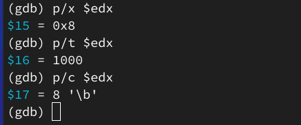{#fig:014 width=70%}

С помощью команды set изменим значение регистра ebx сначала на '2',затем на 2, и после каждого изменения выведем значение edx как строку:

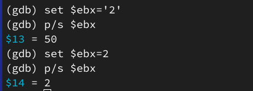{#fig:015 width=70%}

Заметим разницу в выводе:

В первом случае set $ebx='2' - мы присвоили регистру ebx строковое значение '2', поэтому команда p/s $ebx, которая выводит значение как строку, отображает ASCII-код символа "2", который равен 50.

Во втором случае set $ebx=2 - мы присвоили регистру ebx числовое значение 2, теперь команда p/s $ebx выводит число 2, потому что интерпретирует ebx как число, а не как строку.

Выходим из GDB.

### Обработка аргументов командной строки в GDB

Скопируем файл lab8-2.asm в файл lab09-3.asm, создадим исполняемый файл: 

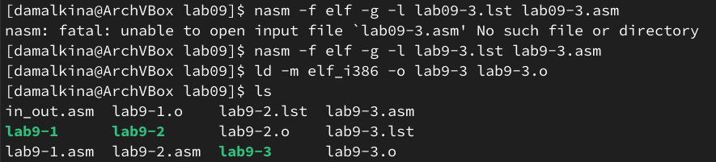{#fig:016 width=70%}

После загрузим исполняемый файл в gdb с помощью ключа --args, передав ему аргументы:

{#fig:017 width=70%}

Установим точку останова перед _start и запустим программу:

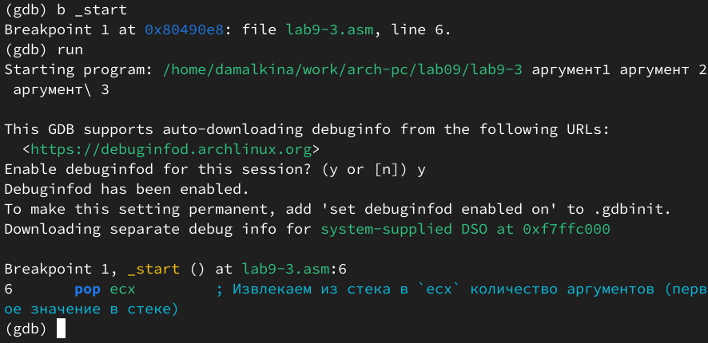{#fig:018 width=70%}

Проверим количество аргументов с помощью команды x/x $esp. Результат - число 5, так как у нас есть имя программы и четыре аргумента. Далее, исследуем содержимое стека. По адресу [esp+4] находится адрес имени программы, по адресу [esp+8] — адрес первого аргумента, по адресу [esp+12] — второго, и так далее:

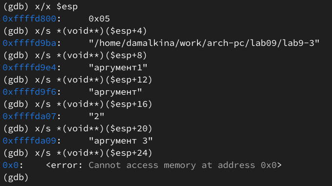{#fig:019 width=70%}

Так как в 32-битных системах, адреса памяти в виде 32-битными числами(32 бита = 4 байта), поэтому мы перемещаемся по стеку с интервалом в 4 байта вперед, чтобы добраться до начала следующего 32-битного адреса.

# Выполнение задания для самостоятельной работы

1. Преобразуем программу из лабораторной работы №8 (Задание №1 для самостоятель-
ной работы), реализовав вычисление значения функции f(x) как подпрограмму.

В сегменте .bss объявим переменную res для хранения результатов вычислений:

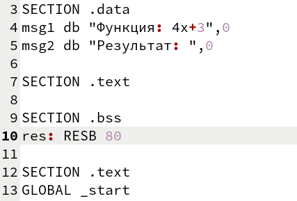{#fig:020 width=70%}

В основной программе добавим вызов подрограммы _funcalcul (33 строка) и изменим операнды в сложении промежуточных результатов функции (35 строка):

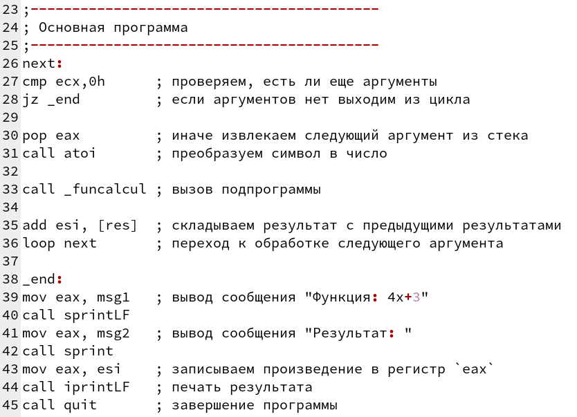{#fig:021 width=70%}

Вынесем вычисления функции за основной код, добавим сохранение результата в переменную res (54 строка):

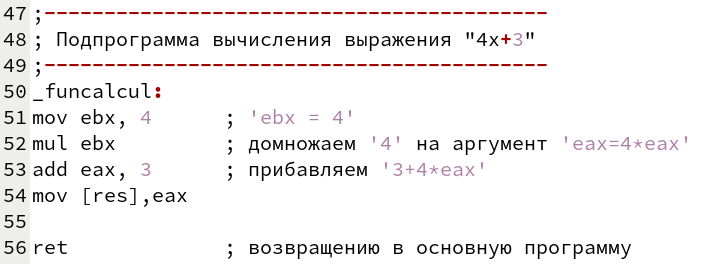{#fig:022 width=70%}

Создаём исполнительный файл и запускаем его, проверим работу программы с разными аргументами, для простоты проверки введем те же аргументы, что и при проверке программы lab8-var5:

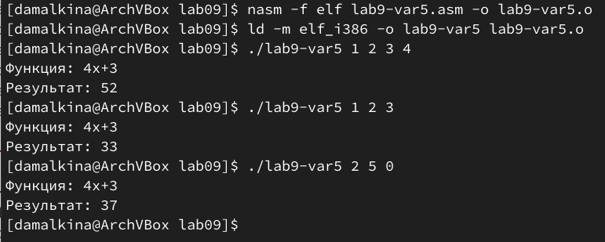{#fig:024 width=70%}

Для сравнения приведем результаты работы программы lab8-var5:

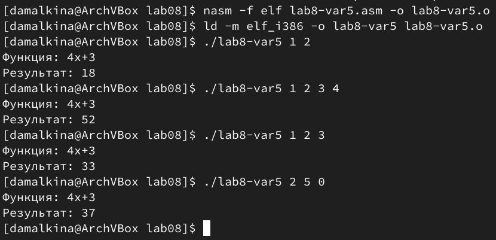{#fig:025 width=70%}

2. В листинге 9.3 приведена программа вычисления выражения (3+2)∗4+5. При запуске данная программа дает результат 10, что неверно, убедимся в этом, посчитав аналитически 5*4+5=20+5=25:

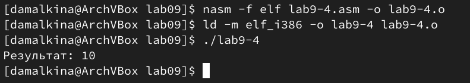{#fig:026 width=70%}

С помощью отладчика GDB, проанализируем изменения значений регистров и определим ошибку.

Соберем исполняемый файл, добавив отладочную информацию, после загрузим исполняемый файл в отладчик GDB и проверим работу программы:

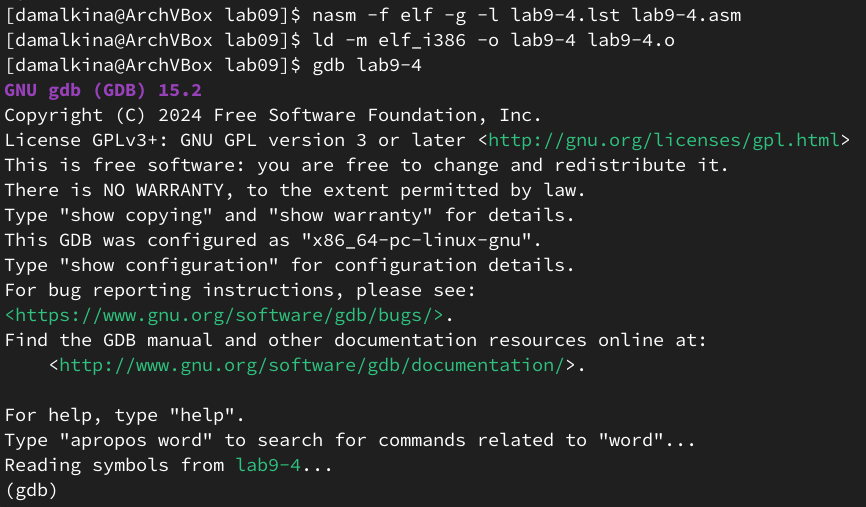{#fig:027 width=70%}

Установим точку останова на метке _start и запустим программу еще раз:

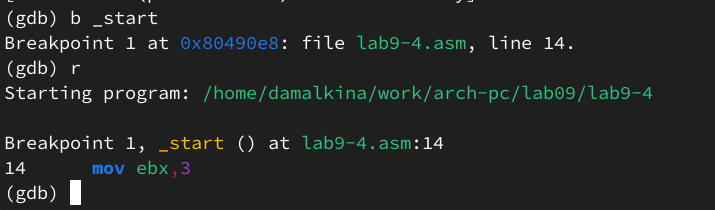{#fig:028 width=70%}

Затем посмотрим дизассемблированный код:

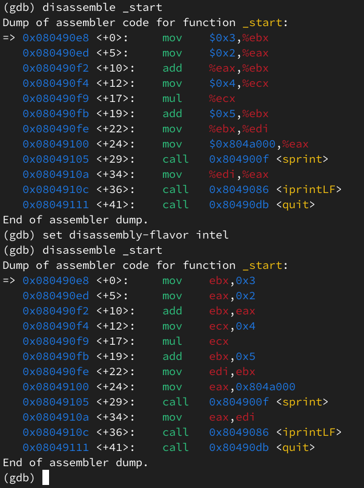{#fig:029 width=70%}

Включим режим псевдографики и добавим точки установа по адресу инструкции  после арифметических команд:

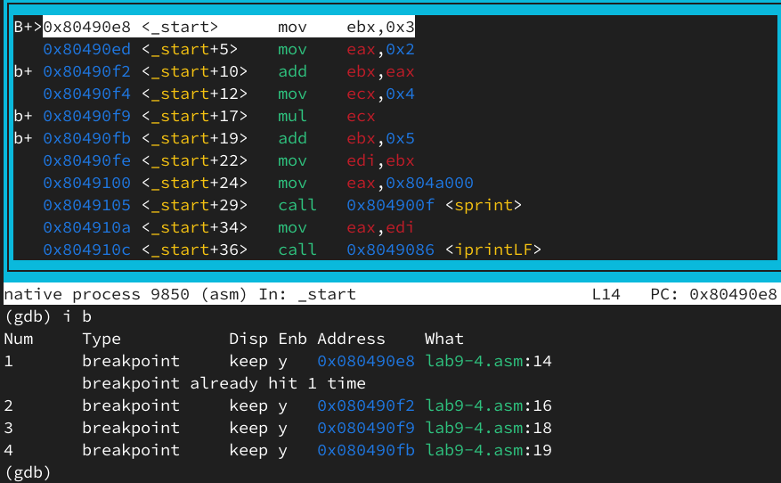{#fig:030 width=70%}

Воспользуемся командами stepi и print, и понаблюдаем, как меняются значения регистров после инструкций. После инструкции add ebx,eax, регистры принимают верные значения:

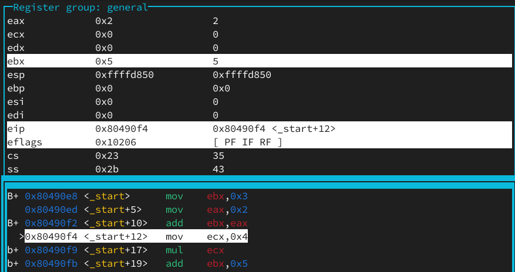{#fig:031 width=70%}

Заметим, что после команды mul ecx, значение ebx остаётся неизменным, хотя должно принимать значение 5*4=20, но меняется значение eax, хотя должно оставаться равным 2. Делаем вывод, что инструкция mul ecx умножает содержимое регистра eax на ecx, а не ebx на ecx, как задумано, результат записывается в eax:

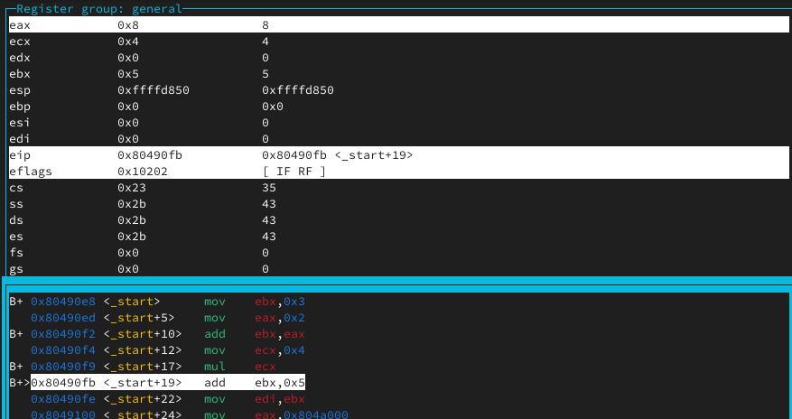{#fig:032 width=70%}

С помощью команды print сравним значения регистров eax, ebx, ecx до команды mul ecx и после:

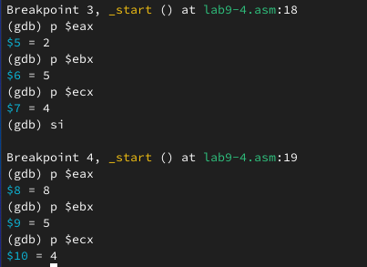{#fig:033 width=70%}

Чтобы исправить это, нужно сначала скопировать содержимое ebx в eax перед выполнением mul ecx. Однако код всё равно неверный из-за того, что после умножения 5 прибавляется к ebx, а не к результату умножения, который находится в eax. Это вторая ошибка - неправильное место для второго сложения:

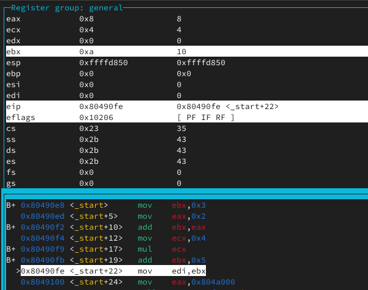{#fig:034 width=70%}

Исправим код, скопируем значение ebx в eax перед выполнением mul ecx и прибавим 5 напрямую к eax, после чего сохраним результат в edi:

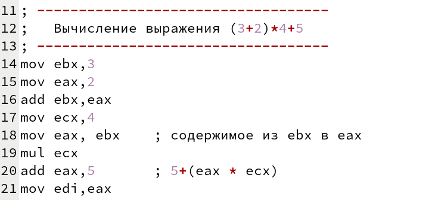{#fig:035 width=70%}

Создим исполнительный файл и запустим его, для проверки работы программы, убедимся, что после внесения изменений программа работает корректно:

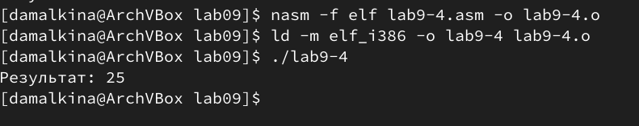{#fig:036 width=70%}

# Выводы

В ходе лабораторной работы и выполнения самостоятельного задания мы приобрели практические навыки написания ассемблерных программ с использованием подпрограмм, попрактиковались в отладке программ с помощью GDB, научились использовать GDB для пошагового выполнения кода, анализа значений регистров и памяти, что позволило нам обнаружить и исправить ошибки в программе. 

# Список литературы{.unnumbered}

::: {#refs}
:::
